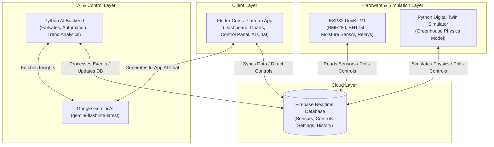

# Smart Greenhouse System

An AI-Powered IoT Monitoring and Autonomous Control System built with an **ESP32 Firmware**, a **Python Backend (Digital Twin Simulator)**, a **Flutter Mobile & Web App**, and **Google Gemini AI**.

---

### Live Web Demo
🚀 **Live Demo:** [https://idilunver.github.io/smart-greenhouse/](https://idilunver.github.io/smart-greenhouse/)

---

[](https://flutter.dev)
[](https://python.org)
[](https://isocpp.org)
[](https://firebase.google.com)
[](https://deepmind.google/technologies/gemini)

## Project Overview

The **Smart Greenhouse System** is a state-of-the-art hybrid IoT system designed for modern precision agriculture. It leverages physical microcontrollers (ESP32) alongside virtual physics-based simulation (Digital Twin) to monitor vital environmental indicators, optimize plant health, and minimize resource usage.

The system features **dual-loop Gemini AI integration**:
1. **Automated Agentic Loop**: The Python backend processes live sensor data, computes complex agricultural metrics (Vapor Pressure Deficit, Evapotranspiration), checks crop-specific rules, and utilizes Google Gemini (`gemini-flash-lite-latest`) to recommend and autonomously trigger environmental adjustments.
2. **Direct Interactive Assistant**: The Flutter mobile/web app includes a chat page where users can directly speak with the "Greenhouse Guardian"—an AI assistant that has real-time access to current sensor values, system configurations, and physical actuator states, allowing it to perform actions directly on your command.

---

## System Architecture

The following diagram illustrates the flow of data and control commands between the edge hardware, digital twin simulator, Firebase Realtime Database, Python AI engine, Google Gemini, and the Flutter app:



---

## Key Features

*   **Cross-Platform Dashboard**: A premium, responsive Flutter app showing real-time environmental metrics (Temperature, Humidity, Soil Moisture, Light intensity, CO₂, VPD, and Evapotranspiration Rate) with intuitive graphs and manual control overrides.
*   **AI Greenhouse Guardian**: An in-app chat interface powered by `gemini-flash-lite-latest`. The AI knows the ideal ranges for specific crops (Tomato, Cucumber, Lettuce, Pepper) and acts warmth-fully to explain parameters or trigger ventilation, irrigation, and lighting.
*   **Physical & Digital Twin Modes**:
    *   **ESP32 Firmware**: Written in C++, utilizing BME280 (interior & exterior), BH1750, capacitive soil moisture sensor, and a 2-channel relay.
    *   **Python Simulator**: A robust simulation tool modeling thermodynamic and physical processes (heat dissipation, evaporation, plant respiration) that interacts with Firebase exactly like the physical hardware.
*   **Historical Analytics**: Includes tools to run 24-hour simulation exports and evaluate system decision performance (Accuracy & F1 scores) against ideal plant-growing rules.
*   **Safe Mode Fail-safe**: Automatic detection of abnormal sensor values (e.g. wire disconnections or out-of-bounds readings) triggering emergency shutdown of actuators to protect the hardware and the crops.

---

## Project Structure

```directory
smart-greenhouse/
├── firmware/                   # ESP32 C++ Source Code
│   └── smart_greenhouse/
│       ├── smart_greenhouse.ino# Arduino entry point
│       ├── config.h            # Pin configurations and thresholds
│       ├── secrets.h.example   # WiFi and Firebase credential template
│       ├── sensors.cpp/h       # BME280, BH1750, and moisture readings
│       ├── actuators.cpp/h     # Relay and actuator controls
│       └── firebase_io.cpp/h   # Firebase Realtime Database integration
├── backend/                    # Python Backend, Simulator, and Analytics
│   ├── data/                   # Simulation exports and configurations
│   ├── main.py                 # Real-time backend system (AI engine & failsafes)
│   ├── simulator.py            # Physics-based Digital Twin Simulator
│   ├── analyze_metrics.py      # Statistical evaluation and chart generator
│   └── requirements.txt        # Python dependency list
├── frontend/                   # Flutter Mobile & Web Client
│   ├── lib/
│   │   ├── config/env.dart     # API Keys and Firebase config
│   │   ├── services/ai_service.dart # Gemini API integration
│   │   ├── pages/              # App views: Dashboard, Control, Charts, AI Chat, Login
│   │   └── main.dart           # App entry point
│   └── pubspec.yaml            # Flutter packages configuration
└── outputs/                    # Output charts generated by analytics (VPD, ET, F1)
```

---

## Getting Started & Installation

### 1. Firebase Setup
1. Create a project in the [Firebase Console](https://console.firebase.google.com/).
2. Enable **Realtime Database** (choose a region, e.g., Europe West).
3. Create a **Service Account** (Project Settings -> Service Accounts) and download the private key JSON file. Save it inside the `backend/` directory as `serviceAccountKey.json`.
4. Register a Web app in your Firebase project to get the web config values (API Key, Project ID, App ID, database URL).

Set your database rules (`database.rules.json`) to allow read/write:
```json
{
  "rules": {
    ".read": "true",
    ".write": "true"
  }
}
```

---

### 2. Backend & Simulator Setup
Navigate to the backend directory:
```bash
cd backend
```

Create a virtual environment and install the dependencies:
```bash
python -m venv venv
# On Windows
venv\Scripts\activate
# On macOS/Linux
source venv/bin/activate

pip install -r requirements.txt
# Install additional packages needed for statistical analytics:
pip install pandas numpy matplotlib scikit-learn
```

Configure your environment variables. Copy `.env.example` to `.env` and fill in your Firebase Database URL and Google Gemini API Key:
```env
FIREBASE_DATABASE_URL=https://your-project-id-default-rtdb.firebaseio.com
SERVICE_ACCOUNT_KEY_PATH=serviceAccountKey.json
GEMINI_API_KEY=your_gemini_api_key_here
```

---

### 3. Frontend Setup
Navigate to the frontend directory:
```bash
cd frontend
```

Make sure Flutter is installed. Retrieve packages:
```bash
flutter pub get
```

Update `frontend/lib/config/env.dart` with your Gemini API Key and Firebase Project details:
```dart
class Env {
  static const geminiApiKey = 'YOUR_GEMINI_API_KEY';
  static const firebaseApiKey = 'YOUR_FIREBASE_API_KEY';
  static const firebaseAppId = 'YOUR_FIREBASE_APP_ID';
  static const firebaseMessagingSenderId = 'YOUR_SENDER_ID';
  static const firebaseProjectId = 'YOUR_PROJECT_ID';
  static const firebaseDatabaseUrl = 'https://YOUR_DATABASE_URL.firebaseio.com';
}
```

---

### 4. ESP32 Firmware Setup
1. Open the project in **Arduino IDE**.
2. Install the ESP32 board definition: **Boards Manager** -> search and install `esp32` by Espressif Systems.
3. Install the following libraries via the **Library Manager**:
   - `Adafruit BME280 Library` (Adafruit)
   - `Adafruit Unified Sensor` (Adafruit)
   - `BH1750` (Christopher Laws)
   - `Firebase Arduino Client Library for ESP8266 and ESP32` (Mobizt)
4. Navigate to `firmware/smart_greenhouse/` and copy `secrets.h.example` to `secrets.h`.
5. Enter your WiFi SSID, Password, and your Firebase Host Database URL & Database Secret (Legacy Database Secret from Service Accounts menu or Web API Key).
6. Connect your ESP32 board and flash the firmware!

---

## Running the System

You can run the virtual simulator (digital twin) or connect the real ESP32 hardware to interact with the system.

### A. Run with Digital Twin (Simulator)
1. **Start the Simulator**:
   ```bash
   cd backend
   python simulator.py
   ```
   *This starts the physics-based simulator, sending virtual sensor readings to Firebase and listening to relay commands every 15 seconds.*
2. **Start the AI Backend Engine**:
   ```bash
   cd backend
   python main.py
   ```
   *This listens to the sensor stream, processes safety rules, applies automation constraints, and calls Gemini for advice on significant temperature fluctuations.*
3. **Launch the Flutter Client**:
   ```bash
   cd frontend
   flutter run -d chrome # Or run on an emulator/device
   ```

### B. Run with Real ESP32 Hardware
1. Power up your ESP32-controlled greenhouse hardware.
2. Start the AI Backend Engine: `python backend/main.py`.
3. Launch the Flutter Client: `flutter run`.

---

## Analytics & Metrics Performance

The system includes a script to analyze greenhouse automation metrics, Vapor Pressure Deficit (VPD), and Evapotranspiration (ET) rates over a simulated 24-hour window.

1. **Export a 24-hour dataset**:
   ```bash
   python backend/simulator.py --export
   ```
2. **Run the analysis and plot the graphs**:
   ```bash
   python backend/analyze_metrics.py
   ```
This generates evaluation metrics and saves charts in the `outputs/` folder:
- **`accuracy_f1_bar.png`**: Compares manual & automatic decision accuracy (Accuracy & F1 scores) of Fan, Pump, and Light systems.
- **`vpd_graph.png`**: Displays Vapour Pressure Deficit curve against the optimal plant growth zone.
- **`et_graph.png`**: Plots Evapotranspiration rate over time.

---

## Web Deployment Guide

Since the frontend is built with Flutter, you can easily host it on the web so visitors can test the dashboard and the AI Chat feature!

### Option A: Firebase Hosting (Recommended)
1. Install the Firebase CLI: `npm install -g firebase-tools`.
2. Login to Firebase: `firebase login`.
3. Initialize hosting in the root directory: `firebase init hosting`.
   - Select your project.
   - Choose `build/web` as the public directory.
   - Configure as a single-page app: `Yes`.
   - Set up automatic builds/deploys with GitHub: `No` (or `Yes` if you want CI/CD).
4. Build the Flutter Web App:
   ```bash
   cd frontend
   flutter build web --release
   ```
5. Deploy to Firebase:
   ```bash
   firebase deploy --only hosting
   ```
*Firebase will provide a live URL (e.g., `https://smart-greenhouse-9fb8e.web.app`) which you can paste at the top of this README!*

### Option B: GitHub Pages
1. Install the `peanut` package to simplify GitHub Pages deployment:
   ```bash
   flutter pub global activate peanut
   ```
2. Run peanut to build and commit the web folder to a `gh-pages` branch:
   ```bash
   # Make sure flutter/bin is in your path
   flutter pub global run peanut
   ```
3. Push the branch to GitHub:
   ```bash
   git push origin --set-upstream gh-pages
   ```
4. In your GitHub repository settings, navigate to **Pages** and set the source branch to `gh-pages`.
*Your site will be live at `https://<your-username>.github.io/smart-greenhouse/`!*

---
